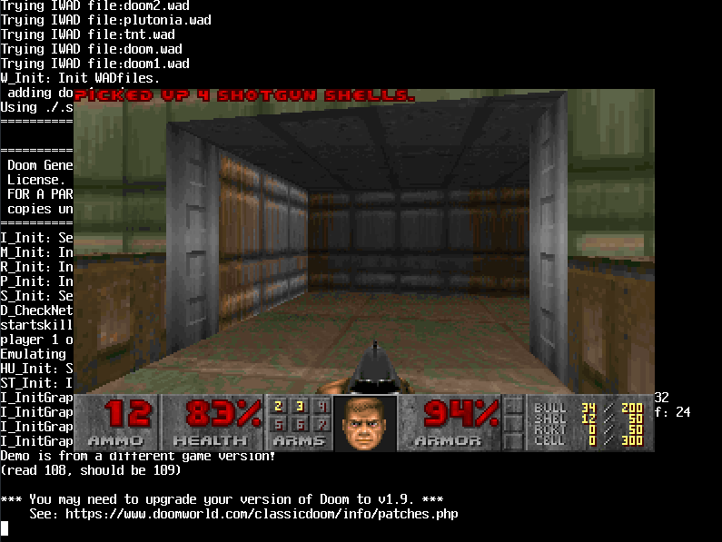

# OpenHobbyOS (OHOS)

```
  ╔═══════════════════════════════════════════╗
  ║         OpenHobbyOS — OHOS                ║
  ║       from-scratch 32-bit x86 kernel      ║
  ╚═══════════════════════════════════════════╝
```

This is my hobby OS. I started writing it one day and I couldn't stop. 32-bit x86 monolithic kernel, written in C with the hot paths in NASM, booting on real hardware, running Doom.




I don't know why I built half of this. I just kept thinking "that'd be cool" and then I'd wake up mod night then start writing an ext2 driver like my life depends on it

---

## What the fuck is this

It's a from-scratch 32-bit operating system. Preemptive multitasking, syscalls, VFS with initrd + ext2 + devfs, a framebuffer console with proper VT100 emulation, networking via lwIP, ACPI power management, and a custom compositor called XNX.

It does not have:
- A network stack I wrote myself (I'm not insane, I ported lwIP)
- USB (I value my remaining sanity)
- Any good reason to exist

---

## Features

- **Preemptive multitasking** with a round-robin scheduler. It works. I have no idea how so dont ask me anywhere.
- **80+ syscall numbers** via `int 0x80`, Linux ABI-compatible. If you know Linux syscalls, you already know how to write userspace for this thing.
- **Per-process page directories** with copy-on-write fork. The paging infrastructure is fully wired. I just haven't enabled it on the CPU yet. It's a debug thing. I'll flip the bit eventually.
- **VFS stack**: initrd (custom cpio-like), ext2 (read + write), devfs. I corrupted a disk image once. It was educational.
- **libtsm framebuffer console** with full VT100 emulation. ANSI colors, scrollback, the whole package. It goes to both the framebuffer and serial so you can watch from two angles.
- **XNX display protocol** — Unix domain socket + pixman compositing. Clients create surfaces, the compositor composites them, pixels hit the hardware framebuffer every 33ms. Yes there's a fullscreen gradient demo. It's art.
- **lwIP TCP/IP** talking to real hardware through an RTL8139 NIC driver. I can ping things. Sometimes they ping back.
- **ACPI power management** via uACPI. Shutdown, reboot, suspend. I control the power grid now.
- **newlib C library** cross-compiled for `i686-openhobbyos-elf`. Your userspace speaks C.
- **Ported software**: fastfetch, Doom, XNX compositor + demo, Lua 5.5, FFmpeg, TinyGL, gears, lwIP, libtsm, uACPI, pixman, zlib.

---

## Requirements

| Thing | Need |
|-------|------|
| **CPU** | i386 / IA-32. Pentium or later. Yes it'll boot on that ThinkPad in your closet. |
| **RAM** | 200–500 MB |
| **Disk** | CD-ROM or IDE disk image |

---

## Build dependencies

```
gcc-multilib (or i686-elf-gcc)
nasm >= 2.15
make, python3 >= 3.8, xorriso, grub-mkrescue, mtools
```

Optional for ports: `meson, ninja, pkg-config, autoconf, automake, cmake`

---

## Quick start

```bash
# Build the whole thing
make all

# Run in QEMU
make run

# Run with serial debug output
make run-debug

# Clean
make clean
```

you will dins the iso in the build folder.

---

## Memory layout

```
0x00000000 - 0x0009FFFF: Low memory (reserved, stay out)
0x000A0000 - 0x000FFFFF: VGA/ROM (also reserved)
0x00100000 - kernel_end:   Kernel code + data (identity mapped, I live here)
kernel_end - 0x02FF0000:   Kernel heap (kmalloc territory)
0x03000000+:               User ELF loading (48MB+ available)
```

Paging is **fully initialized** but **not enabled on the CPU**. Why? Debugging. Turn it on and it works fine . I just haven't bothered to flip the bit on every boot cus im lazy.

---

## Syscall interface

Linux ABI-compatible via `int 0x80`. I stole the numbers so you don't have to learn another ABI:

- File I/O: open, read, write, close, lseek, ioctl, mmap, brk
- Process: fork, execve, wait, exit, getpid
- IPC: pipe, Unix sockets
- Time: clock_gettime, nanosleep
- OHOS-specific: spawn, yield at 400+

---

## Filesystem stack

```
VFS → initrd (read-only, boot) | ext2 (read/write, disk) | devfs (/dev/*)
Block layer: VFS → blkdev → ATA → Disk
```

**initrd** is a custom cpio-like archive embedded in the kernel. Holds every binary the system needs to boot to a shell.

**ext2** does full read and write. I handle inodes, block groups, directory entries. I've also produced some beautifully corrupted disk images. It's a rite of passage — you haven't lived until you've debugged an ext2 write at 3am with a hex editor.

**devfs** gives you `/dev/fb0`, `/dev/null`, `/dev/zero`, and a console device. The classics.

---

## Graphics

```
Early boot:      VGA text mode (80x25, retro chic)
Framebuffer:     libtsm with VT100 emulation
XNX compositor:  Custom display protocol over Unix domain sockets
```

**libtsm** is a terminal emulator linked directly into the kernel. VT100 escape sequences, ANSI colors, scrollback buffer, the works. Output hits both the framebuffer and serial simultaneously.

**XNX** is the display protocol I wrote. Clients connect to `/tmp/xnx.sock`, create surfaces, push pixel buffers. The compositor composites everything with pixman and flushes to the hardware framebuffer. It's basically a baby Wayland but worse and I'm proud of it.

---

## Network

```
lwIP → netdev → RTL8139 PCI NIC → the internet (probably)
```

lwIP ported as a userspace library. RTL8139 driver does PCI enumeration + MMIO. The whole pipeline works. I can ping things. It feels like magic because it basically is.

---

## Credits

Thanks to the other depressed veterans who suffered through this so lazy people like me can use it . credits where its due:

uACPI : the power management

lwip : the tls and networking duh

lodepng : loading png files 

zlib : file compression .

pixman : drawing pixels and rendering

doomgeneric : for making doom even run

libtsm : for being an actually correct state machine for VT100.

fastfetch : for making things look more ric-ey

lua : the scripting language that refuses to be unused

ffmpeg : the multimedia library i will never use

tinygl : opengl in a shoebox

gears : spinning for the sake of spinning


---

## License

BSD 3-Clause. Go wild. See `LICENSE`. Don't sue me if it fucks up your PC. It probably won't. Probably.
